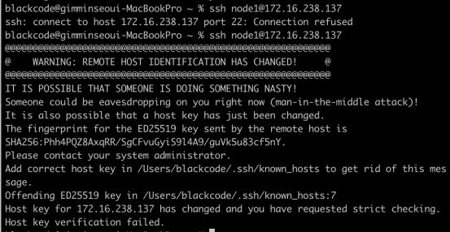

<iframe width="560" height="315" src="https://www.youtube.com/embed/6n5obRKsCRQ?list=PLApuRlvrZKohaBHvXAOhUD-RxD0uQ3z0c" title="[따배쿠] 0. 따라하면서 배우는 쿠버네티스 입문편 - OT" frameborder="0" allow="accelerometer; autoplay; clipboard-write; encrypted-media; gyroscope; picture-in-picture; web-share" allowfullscreen></iframe>

---

## [실습 예제](https://github.com/237summit/Getting-Start-Kubernetes.git)

## 실습 환경 : 직접설치 

#### [Windows10에 Virtual Box 설치, 네트워크 구성 및 가상머신에 Ubuntu20.04설치](https://www.youtube.com/watch?v=CKUv3oEI8Yo&t=363s)

#### [Master, Node1, Node2 시스템에 도커 설치](https://www.youtube.com/watch?v=V5-h3yvCOSA&t=518s)

#### [쿠버네티스 설치 : v1.18](https://www.youtube.com/watch?v=5Y847xaXe7U)

## 온라인 K8S Playground 사용하기
https://www.katacoda.com/courses/kube...
https://labs.play-with-k8s.com/

# 쿠버네티스 환경 구성

## 1. 가상환경 구성
- 가상환경 도구
    - vmware fusion 13
- OS : ubuntu 20.04 LTS Desktop
- 환경 구성
    - master
    - node1
    - node2

## 2. 가상환경 세팅
1. apt-get 명령어 update
```
sudo apt-get update
```

2. ssh 설치
```
sudo apt-get install openssh-server
```

3. ip정보를 위한 net-tools 설치
```
sudo apt install net-tools
```

## 3. 접속테스트
- ssh 접속
```
ssh <계정명>@<server ip>
```

- ssh 접속시 다음과 같은 경고가 발생하는 경우
    - 
    1. 다음 명령어 입력하여 known_hosts 내용 갱신
    ```
    ssh-keygen -R <접속서버ip>
    ```
    2. 접속 시도
    - 
    - 정상접속 확인

## 4. Docker 설치
- [Docker Docs](https://docs.docker.com/engine/install/ubuntu/)
1. repository를 이용한 설치(Install using the apt repository)

    1. 설치전 필요한 페키지설치
    ```
    # Update the apt package index and install packages to allow apt to use a repository over HTTPS:
    sudo apt-get update
    sudo apt-get install -y ca-certificates curl gnupg
    ```

    2. 도커에 GPG키 설치
    ```
    # Add Docker’s official GPG key:
    sudo install -m 0755 -d /etc/apt/keyrings
    curl -fsSL https://download.docker.com/linux/ubuntu/gpg | sudo gpg --dearmor -o /etc/apt/keyrings/docker.gpg
    sudo chmod a+r /etc/apt/keyrings/docker.gpg
    ```

    3. repository등록
    ```
    # Use the following command to set up the repository:
    echo \
    "deb [arch="$(dpkg --print-architecture)" signed-by=/etc/apt/keyrings/docker.gpg] https://download.docker.com/linux/ubuntu \
    "$(. /etc/os-release && echo "$VERSION_CODENAME")" stable" | \
    sudo tee /etc/apt/sources.list.d/docker.list > /dev/null
    ```
2. Docker Engine 설치(Install Docker Engine)

    1. apt 업데이트
    ```
    sudo apt-get update
    ```

    2. docker-ce docker-ce-cli containerd.io(도커엔진) 설치 진행
    ```
    sudo apt-get install -y docker-ce docker-ce-cli containerd.io docker-buildx-plugin docker-compose-plugin
    ```

    ## Docker 설치명령어 통합[master, node1, node2]
    ```
    sudo apt-get update
    sudo apt-get install -y ca-certificates curl gnupg
    sudo install -m 0755 -d /etc/apt/keyrings
    curl -fsSL https://download.docker.com/linux/ubuntu/gpg | sudo gpg --dearmor -o /etc/apt/keyrings/docker.gpg
    sudo chmod a+r /etc/apt/keyrings/docker.gpg
    echo \
    "deb [arch="$(dpkg --print-architecture)" signed-by=/etc/apt/keyrings/docker.gpg] https://download.docker.com/linux/ubuntu \
    "$(. /etc/os-release && echo "$VERSION_CODENAME")" stable" | \
    sudo tee /etc/apt/sources.list.d/docker.list > /dev/null
    sudo apt-get update
    sudo apt-get install -y docker-ce docker-ce-cli containerd.io docker-buildx-plugin docker-compose-plugin
    ```

3. Docker 설치 확인
```
docker version
systemctl enable docker
systemctl start docker
```