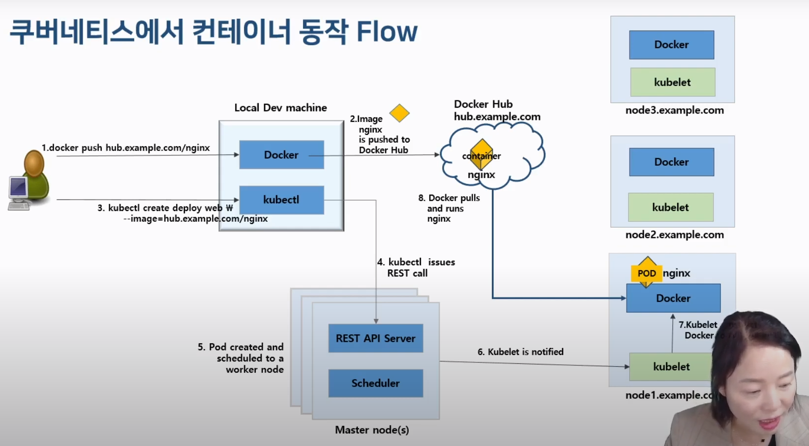

<iframe width="560" height="315" src="https://www.youtube.com/embed/Iue9TC13vPQ?list=PLApuRlvrZKohaBHvXAOhUD-RxD0uQ3z0c" title="[따배쿠] 4-1. 쿠버네티스 아키텍처 - Kubernetes 동작원리" frameborder="0" allow="accelerometer; autoplay; clipboard-write; encrypted-media; gyroscope; picture-in-picture; web-share" allowfullscreen></iframe>

---

# *** K8S 명령어 실습전 AKS 환경 준비 ***

## VSCODE에서 Azure Potal 접속
1. VSCode에서 명령어 실행
```
Connect-AzAccount
```

2. 계정 선택 및 로그인 진행


* 아래와 같이 연동작업 

```
PS D:\GIT> Connect-AzAccount
경고: Unable to acquire token for tenant '4aed9820-113d-4f48-9f53-4d91f37ad279' with error 'SharedTokenCacheCredential authentication unavailable. Token acquisition 
failed for user minseo_kim89@megazone.com. Ensure that you have authenticated with a developer tool that supports Azure single sign on.'

Account                   SubscriptionName TenantId                             Environment
-------                   ---------------- --------                             -----------
minseo_kim89@megazone.com kms-limited      xxxxxxxx-xxxx-xxxx-xxxx-xxxxxxxxxxxx AzureCloud
```
3. [AzurePotal] Azure Potal에 접속
    
    1). 상단에 있는 Cloud Shell을 클릭하여 `스토리지 생성`
<br>
    2). 스토리지 만들기 클릭
<br>
    3). Cloud Shell 진입


4. VSCODE에서 Azure Cloud Shell 클릭


5. 상단에 구독 선택


6. VSCode에서 접속 성공한 모습


## VSCode 연동작업 완료

---

# 목차
- 쿠버네티스 동작원리
- namespace
- yaml
- api version

---
# 쿠버네티스 동작원리
## 쿠버네티스에서 컨테이너 동작 FLOW


1. 개발자가 컨테이너 Build
    - mainui
    - login
    - pay

2. 도커 명령어(push)로 저장소에 저장
    - public : Docker Hub
    - private : 사내 hub

3. 개발자 및 운영자가 쿠버네티스에게 컨테이너가 실행될 수 있도록 명령어 실행
    - kubectl create deploy web --image=hub.example.com/nginx

4. Control plane(Master node(s))
    - `api 컨테이너`가 실행 요청 수행
    - 컨테이너를 어떤 노드에 실행할지 `Scheduler`에게 질의
    - `Scheduler`가 노트상태 분석 후 적절한 노드를 `api 컨테이너`에게 보고
    - `api 컨테이너`가 스커쥴러를 통해 전달받은 노드의 `kubelet`에게 컨테이너 실행 요청

5. 요청받은 노드의 `kubelet`
    - api의 요청을 docker 명령어로 바꿔 `Docker데몬`에 실제 컨테이너 실행 요청

6. `Docker데몬`
    - hub를 통해 요청받은 컨테이너(ex: nginx) 확인
    - 이미지를 받아와 `컨테이너(POD)` 실행
    - 쿠버네티스는 컨테이너를 POD단위로 관리

## 쿠버네티스 컴포넌트
- 마스터 컴포넌트
    -  etcd
        - key-value 타입의 저장소
    - kube-apiserver
        - k8s API를 사용하도록 요청을 받고 요청이 유효한지 검사
    - kube-scheduler
        - 파드를 실행할 노드 선택
    - kube-controller-manager
        - 파드를 관찰하며 개수를 보장
- 워커 노드 컴포넌트
    - kubelet
        - 모든 노드에서 실행되는 k8s 에이전트
        - 데몬 형태로 동작
    - kube-proxy
        - k8s의 network 동작을 관리
        - iptables rule을 구성
    - 컨테이너 런타임
        - 컨테이너를 실행하는 엔진
        - docker, containerd, runc

## 쿠버네티스 아키텍쳐
